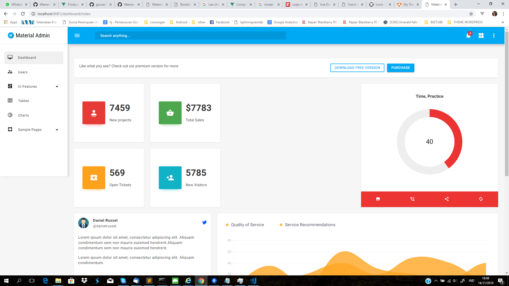

# govue
<h1>This is my first App with Go language</h1>

<h1>Material Admin</h1>
Material Admin is yet another incredible admin template from Bootstrapdash that is based on Google Material Design framework. The template is tastefully designed and coded to perfection. Material Admin comes packed with a lot of material design components, UI elements and built-in sample pages to kick-start your project.
  
The template is highly customizable so that you can alter the design to suit your needs and give it a unique look and very well-documented to help you get started without any issues.

<h1>Credits:</h1>

- Google Material Design Framework
- Material Design Icons
- jQuery
- Gulp
- Chart.js

<h1>Browser Support:</h1>

Material Admin is designed to work flawlessly with all the latest and modern web browsers.

- Chrome (latest)
- FireFox (latest)
- Safari (latest)
- Opera (latest)
- IE10+  

<h1>License Information:</h1>

Material Admin is released under MIT license. Material Admin is a free Material Design admin template developed by BootstrapDash. Feel free to download it, use it, share it, and get creative with it.
